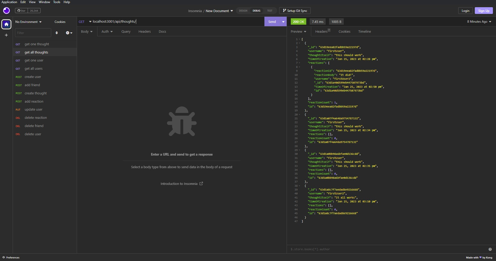

 # social-media-startup

### Description

Backend for a social media start up using MongoDB and Express.

## Table of Contents
1. [Description: ](#description)
2. [Installation Guide: ](#installation-guide)
3. [Image: ](#image)
- [License](#license)
- [Contacts ](#contact-me)

[Back to top](#social-media-startup)
## Installation Guide

run npm i, run mongod in a seperate terminal, open another terminal and run mongo to open shell, run use socialMedia in shell, run npm start, use insomnia or another similar app to interact.

[Back to top](#social-media-startup)
## Image

[Back to top](#social-media-startup)

## License
  This project is under the MIT License
[Details on the MIT License](https://choosealicense.com/licenses/mit/)

## Contact Me
### Email
[schuylertjed@gmail.com](mailto:schuylertjed@gmail.com)
### Github
[jschuyl](https://github.com/jschuyl)

[Back to top](#social-media-startup)

